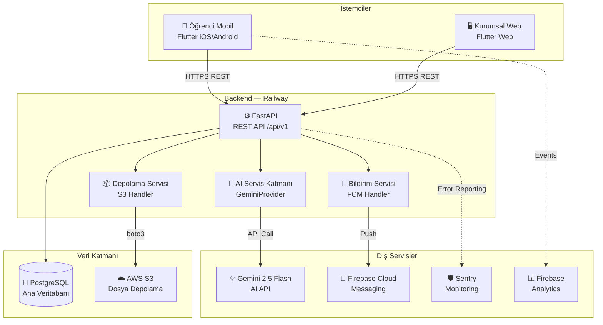
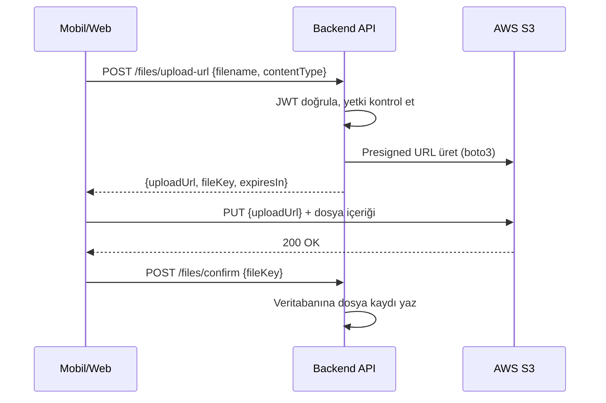
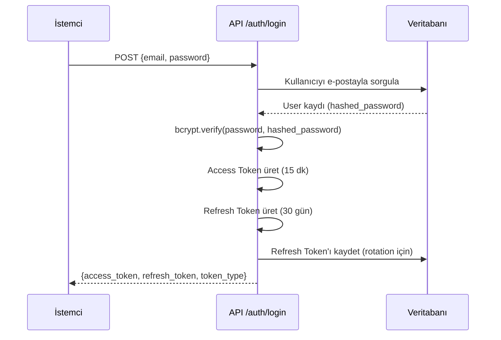
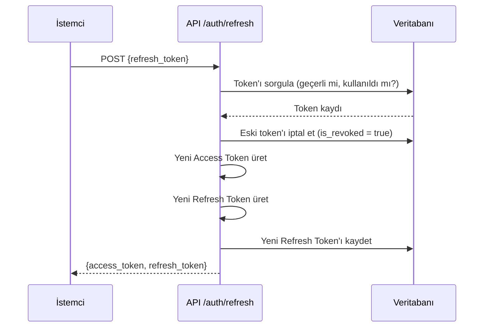

# StudyOS — Yazılım Mimarisi

**Belge Durumu:** Aktif  
**Sürüm:** 1.1  
**Oluşturuldu:** 2026-07-06 — Meeting-007  
**Güncelleme Tarihi:** 2026-07-06 — Meeting-007 açık sorular kapatıldı  
**Dil:** Türkçe  
**Kaynak Belgeler:** `docs/architecture/technology-decisions.md`, `docs/planning/feature-matrix.md`

> Bu belge geliştirme başlamadan önceki nihai mimari tasarımı içerir.  
> Değişiklik için yeni bir toplantı ve proje sahibi onayı gerekir.

---

## 1. Genel Sistem Mimarisi

StudyOS iki bağımsız istemciden, ortak bir backend API'den ve yardımcı servislerden oluşur.

### 1.1 Bileşen Listesi

| Bileşen | Teknoloji | Rol |
|---------|-----------|-----|
| Öğrenci Mobil Uygulaması | Flutter (iOS/Android) | Native mobil uygulama |
| Kurumsal Web Platformu | **Flutter Web** | Dershane yönetim paneli — giriş gerektiren SPA |
| Backend API | FastAPI (Python) | Tüm iş mantığı, veri doğrulama, yetkilendirme |
| Veritabanı | PostgreSQL | Kalıcı ilişkisel veri depolama |
| Bulut Depolama | AWS S3 (dev: MinIO) | PDF, materyal, resim dosyaları |
| AI Servisi | Gemini 2.5 Flash | Çalışma koçu, plan üretimi, analiz |
| Bildirim Servisi | Firebase Cloud Messaging | Push notification |
| İzleme | Sentry | Hata takibi ve performans izleme |
| Analitik | Firebase Analytics | Kullanıcı davranış analizi |

> **Karar:** Kurumsal Web Platformu Flutter Web ile geliştirilecektir. Gerekçe: `docs/decisions/ADR-001-flutter-web-kurumsal-platform.md`

---

### 1.2 Sistem Mimarisi Diyagramı



---

### 1.3 İletişim Protokolleri

| Bağlantı | Protokol | Format | Güvenlik |
|----------|----------|--------|---------|
| Mobil → Backend | HTTPS | JSON | JWT Bearer Token |
| Web → Backend | HTTPS | JSON | JWT Bearer Token |
| Backend → PostgreSQL | TCP (SSL) | SQL | VPC / Private Network |
| Backend → AWS S3 | HTTPS | Binary | IAM + Presigned URL |
| Backend → Gemini API | HTTPS | JSON | API Key |
| Backend → FCM | HTTPS | JSON | Firebase Service Account |
| Mobil → S3 (upload) | HTTPS | Binary | Presigned URL (Backend üretir) |

### 1.4 Presigned URL Akışı (Dosya Yükleme)

Dosyalar backend üzerinden geçmez. İstemci, backend'den geçici bir S3 URL alır ve direkt S3'e yükler.



---

## 2. Proje Klasör Yapısı

### 2.1 Flutter Mobil Uygulama

Mimari yaklaşım: **Feature-First Clean Architecture**

Her özellik (feature) kendi içinde bağımsızdır. Ortak bileşenler `core/` ve `shared/` altında toplanır.

```
studyos_mobile/
├── lib/
│   ├── main.dart                    # Uygulama giriş noktası
│   ├── app.dart                     # MaterialApp, Router, Provider konfigürasyonu
│   │
│   ├── core/                        # Uygulama genelinde çekirdek altyapı
│   │   ├── constants/               # Sabit değerler (API URL, timeout, vb.)
│   │   ├── errors/                  # Özel hata sınıfları (AppException, NetworkException)
│   │   ├── extensions/              # Dart extension metodları
│   │   ├── network/                 # HTTP istemci konfigürasyonu (Dio)
│   │   ├── router/                  # GoRouter route tanımları ve guards
│   │   ├── theme/                   # Renk paleti, tipografi, ThemeData
│   │   └── utils/                   # Tarih formatı, input validasyon yardımcıları
│   │
│   ├── features/                    # Özellik modülleri (feature-first)
│   │   ├── auth/                    # Kimlik doğrulama (giriş, kayıt, şifre sıfırlama)
│   │   │   ├── data/
│   │   │   │   ├── datasources/     # remote_auth_datasource.dart
│   │   │   │   └── repositories/   # auth_repository_impl.dart
│   │   │   ├── domain/
│   │   │   │   ├── entities/        # AuthUser entity
│   │   │   │   ├── repositories/   # auth_repository.dart (interface)
│   │   │   │   └── usecases/        # login_usecase.dart, register_usecase.dart
│   │   │   └── presentation/
│   │   │       ├── providers/       # auth_provider.dart (Riverpod)
│   │   │       ├── screens/         # login_screen.dart, register_screen.dart
│   │   │       └── widgets/         # login_form.dart, auth_button.dart
│   │   │
│   │   ├── dashboard/               # Ana sayfa ve genel görünüm
│   │   ├── study_plan/              # Günlük çalışma planı (S-06)
│   │   ├── subject_tracker/         # Konu ve soru takibi (S-08, S-09)
│   │   ├── pomodoro/                # Pomodoro zamanlayıcı (S-10)
│   │   ├── statistics/              # İstatistik ve grafikler (S-14)
│   │   ├── notifications/           # Bildirim yönetimi (S-17, S-18)
│   │   ├── subscription/            # Premium üyelik (S-19)
│   │   └── profile/                 # Profil ve ayarlar (S-03)
│   │
│   ├── shared/                      # Birden fazla feature'da kullanılan paylaşımlı bileşenler
│   │   ├── widgets/                 # AppButton, AppCard, LoadingIndicator, EmptyState
│   │   ├── models/                  # Paylaşımlı veri modelleri (JSON <-> Dart)
│   │   └── providers/               # Paylaşımlı Riverpod provider'lar
│   │
│   └── services/                    # Platform servisleri ile entegrasyon
│       ├── storage_service.dart     # AWS S3 presigned URL yükleme
│       ├── notification_service.dart # FCM token yönetimi
│       ├── analytics_service.dart   # Firebase Analytics event wrapping
│       └── local_storage_service.dart # drift veritabanı yönetimi
│
├── test/
│   ├── unit/                        # Birim testler (usecase, repository)
│   ├── widget/                      # Widget testler
│   └── integration/                 # Entegrasyon testleri
│
├── assets/
│   ├── images/
│   ├── icons/
│   └── fonts/
│
└── pubspec.yaml
```

#### Feature Klasörü İç Yapısı (Clean Architecture Katmanları)

Her `features/[feature_name]/` klasörü şu katmanları içerir:

| Katman | Klasör | Sorumluluk |
|--------|--------|-----------|
| **Sunum** | `presentation/` | Ekranlar, widget'lar, Riverpod provider'lar |
| **Domain** | `domain/` | Entity'ler, use case'ler, repository interface'leri |
| **Veri** | `data/` | API çağrıları, yerel DB, repository implementasyonları |

Bağımlılık yönü: `presentation → domain ← data`

---

### 2.2 FastAPI Backend

Mimari yaklaşım: **Domain-Based Modular Monolith**

MVP için monolitik yapı; ileride servislere bölünmeye hazır modüler tasarım.

```
studyos_backend/
├── app/
│   ├── main.py                      # FastAPI app oluşturma, middleware, router kayıt
│   │
│   ├── core/                        # Uygulama çekirdeği
│   │   ├── config.py                # Ortam değişkenleri (pydantic BaseSettings)
│   │   ├── security.py              # JWT üretme/doğrulama, şifre hash
│   │   ├── dependencies.py          # FastAPI Depends() fonksiyonları
│   │   └── exceptions.py            # Özel exception sınıfları ve handler'lar
│   │
│   ├── database/                    # Veritabanı altyapısı
│   │   ├── base.py                  # SQLAlchemy Base, engine, session factory
│   │   ├── session.py               # AsyncSession bağımlılığı (get_db)
│   │   └── migrations/              # Alembic migration dosyaları
│   │       ├── env.py
│   │       └── versions/
│   │
│   ├── models/                      # SQLAlchemy ORM modelleri (veritabanı tabloları)
│   │   ├── user.py
│   │   ├── student.py
│   │   ├── institution.py
│   │   ├── teacher.py
│   │   ├── class_.py
│   │   ├── study_plan.py
│   │   ├── subject.py
│   │   ├── exam.py
│   │   ├── question_stat.py
│   │   ├── assignment.py
│   │   ├── notification.py
│   │   └── subscription.py
│   │
│   ├── schemas/                     # Pydantic şemaları (request/response doğrulama)
│   │   ├── auth.py                  # LoginRequest, TokenResponse, RegisterRequest
│   │   ├── user.py                  # UserCreate, UserRead, UserUpdate
│   │   ├── student.py
│   │   ├── institution.py
│   │   ├── study_plan.py
│   │   ├── subject.py
│   │   ├── exam.py
│   │   ├── notification.py
│   │   └── common.py                # PaginatedResponse, ErrorResponse
│   │
│   ├── repositories/                # Veri erişim katmanı (database CRUD)
│   │   ├── base.py                  # BaseRepository (generic CRUD)
│   │   ├── user_repository.py
│   │   ├── student_repository.py
│   │   ├── institution_repository.py
│   │   ├── study_plan_repository.py
│   │   ├── exam_repository.py
│   │   └── notification_repository.py
│   │
│   ├── services/                    # İş mantığı katmanı
│   │   ├── auth_service.py          # Giriş, kayıt, token yenileme
│   │   ├── user_service.py
│   │   ├── student_service.py
│   │   ├── institution_service.py
│   │   ├── study_plan_service.py
│   │   ├── exam_service.py
│   │   ├── notification_service.py
│   │   ├── storage_service.py       # S3 presigned URL üretimi
│   │   └── ai_service.py            # AI provider abstraction
│   │
│   ├── api/                         # HTTP endpoint tanımları
│   │   ├── router.py                # Tüm router'ları birleştirme
│   │   └── v1/                      # API versiyonu
│   │       ├── auth.py              # /api/v1/auth/*
│   │       ├── users.py             # /api/v1/users/*
│   │       ├── students.py          # /api/v1/students/*
│   │       ├── institutions.py      # /api/v1/institutions/*
│   │       ├── study_plans.py       # /api/v1/study-plans/*
│   │       ├── subjects.py          # /api/v1/subjects/*
│   │       ├── exams.py             # /api/v1/exams/*
│   │       ├── statistics.py        # /api/v1/statistics/*
│   │       ├── notifications.py     # /api/v1/notifications/*
│   │       ├── files.py             # /api/v1/files/*
│   │       └── ai.py                # /api/v1/ai/*
│   │
│   ├── middleware/                  # FastAPI middleware'leri
│   │   ├── auth_middleware.py       # JWT doğrulama middleware
│   │   ├── logging_middleware.py    # İstek/yanıt loglama
│   │   ├── rate_limit.py            # slowapi rate limiting
│   │   └── cors.py                  # CORS politikası konfigürasyonu
│   │
│   └── providers/                   # Dış servis adaptörleri
│       ├── ai/
│       │   ├── base.py              # AIProvider abstract sınıfı
│       │   ├── gemini_provider.py   # GeminiProvider implementasyonu
│       │   └── openai_provider.py   # OpenAIProvider implementasyonu (ileride)
│       ├── storage/
│       │   └── s3_provider.py       # AWS S3 boto3 işlemleri
│       └── notification/
│           └── fcm_provider.py      # Firebase Admin SDK push notification
│
├── tests/
│   ├── unit/                        # Servis ve repository birim testleri
│   ├── integration/                 # API endpoint entegrasyon testleri
│   └── conftest.py                  # pytest fixture'ları
│
├── alembic.ini                      # Alembic konfigürasyonu
├── pyproject.toml                   # Bağımlılık yönetimi (uv veya poetry)
├── Dockerfile
├── docker-compose.yml               # Yerel geliştirme (PostgreSQL + MinIO)
└── .env.example                     # Örnek ortam değişkenleri
```

#### Katman Sorumlulukları ve Bağımlılıklar

```
HTTP İsteği
    ↓
api/v1/*.py          (Route, giriş doğrulama, yetki kontrolü)
    ↓
services/*.py        (İş mantığı, domain kuralları)
    ↓
repositories/*.py    (Veri erişimi, SQL sorguları)
    ↓
models/*.py          (SQLAlchemy ORM tabloları)
    ↓
PostgreSQL
```

> Bağımlılık yönü tek yönlüdür. `api` katmanı `services`'i çağırır; `services` `repositories`'i çağırır. Hiçbir katman bir üst katmanı import etmez.

---

## 3. Güvenlik Mimarisi

### 3.1 JWT Kimlik Doğrulama

StudyOS, Firebase Authentication kullanmaz. Tüm kimlik yönetimi kendi implementasyonumuzdur.



| Token | Süre | Depolama (İstemci) | İçerik |
|-------|------|-------------------|--------|
| Access Token | 15 dakika | Bellekte (in-memory) | user_id, role, exp |
| Refresh Token | 30 gün | Güvenli depolama (flutter_secure_storage) | token_id, user_id, exp |

### 3.2 Token Yenileme (Refresh Token Rotation)

Her refresh token kullanıldığında geçersiz kılınır ve yenisi verilir. Bu sayede çalınan token'ların tekrar kullanımı engellenir.



### 3.3 Şifre Güvenliği

- Şifreler `bcrypt` algoritmasıyla hash'lenir (passlib[bcrypt], work factor: 12).
- Düz metin şifre hiçbir zaman veritabanına yazılmaz.
- Şifre sıfırlama: e-posta ile gönderilen tek kullanımlık token (15 dakika geçerli).

### 3.4 Rol Tabanlı Erişim Kontrolü (RBAC)

| Rol | Kod | Açıklama |
|-----|-----|---------|
| Öğrenci | `student` | Kendi verilerine erişir |
| Öğretmen | `teacher` | Atandığı sınıf ve öğrencilere erişir |
| Kurum Yöneticisi | `institution_admin` | Kendi kurumunun tüm verilerine erişir |
| Sistem Yöneticisi | `system_admin` | Tüm sisteme erişir |

FastAPI'de roller `Depends()` dekoratörü ile endpoint düzeyinde kontrol edilir:

```
GET /api/v1/institutions/{id}/students
  → Sadece institution_admin ve system_admin erişebilir
  → institution_admin yalnızca kendi kurumunun öğrencilerini görebilir
```

### 3.5 Dosya Yükleme Güvenliği

- Dosyalar backend üzerinden geçmez; Presigned URL ile doğrudan S3'e yüklenir.
- Presigned URL süresi: 5 dakika.
- İzin verilen dosya uzantıları backend tarafında doğrulanır: `.pdf`, `.jpg`, `.jpeg`, `.png`, `.mp4`.
- Maksimum dosya boyutu S3 bucket policy ile sınırlandırılır.
- Her dosya, kullanıcıya özel bir S3 key ile saklanır: `uploads/{user_id}/{uuid}.{ext}`.

### 3.6 API Güvenliği

| Güvenlik Önlemi | Uygulama |
|----------------|---------|
| Rate Limiting | slowapi; 60 istek/dakika (genel), 10 istek/dakika (auth) |
| CORS | Yalnızca beyaz listedeki origin'ler kabul edilir |
| HTTPS | Railway üzerinde otomatik TLS/SSL |
| SQL Injection | SQLAlchemy ORM parametreli sorgular |
| Input Validation | Pydantic şemaları tüm giriş verilerini doğrular |
| Sensitive Data | Şifre, token alanları response şemalarından çıkarılır |

### 3.7 CORS Politikası

```
İzin Verilen Origin'ler:
  - https://app.studyos.com        (production web)
  - http://localhost:3000          (geliştirme)
  - http://localhost:5173          (geliştirme)

Geliştirme ortamında: tüm origin'ler açık
Üretim ortamında: yalnızca beyaz liste

İzin Verilen Metodlar: GET, POST, PUT, PATCH, DELETE, OPTIONS
İzin Verilen Header'lar: Authorization, Content-Type
```

---

## 4. Ölçeklenebilirlik Stratejisi

### 4.1 MVP Aşaması (0 – 1.000 Kullanıcı)

**Hedef:** Hızlı geliştirme, düşük maliyet, tek sunucu.

```
[Mobil] → [Railway — FastAPI (1 instance)] → [PostgreSQL (Railway)]
                                            → [AWS S3]
                                            → [Gemini API]
```

- Tek Railway instance üzerinde FastAPI.
- Railway üzerinde managed PostgreSQL.
- Sentry ücretsiz tier.
- MinIO ile local geliştirme, AWS S3 ile production.

### 4.2 Büyüme Aşaması (1.000 – 10.000 Kullanıcı)

**Hedef:** Güvenilirlik, temel yatay ölçekleme.

```
[İstemciler] → [Railway — FastAPI (2 instance, load balanced)]
                          → [PostgreSQL + Read Replica]
                          → [Redis — Cache + Rate Limit]
                          → [AWS S3]
```

Yapısal değişiklikler:
- PostgreSQL read replica: okuma yoğun sorgular (istatistik, raporlar) ayrı replica'dan yapılır.
- Redis cache: sık erişilen ve nadiren değişen veriler (konu listesi, aktif abonelik durumu) önbelleklenir.
- Redis rate limiter: slowapi'nin Redis backend'i ile dağıtık rate limiting.

### 4.3 Ölçek Aşaması (10.000 – 100.000 Kullanıcı)

**Hedef:** Yüksek erişilebilirlik, maliyet optimizasyonu.

```
[İstemciler] → [AWS ALB / CloudFront]
                  → [AWS ECS — FastAPI (auto-scaling)]
                     → [AWS RDS PostgreSQL (Multi-AZ)]
                     → [ElastiCache Redis]
                     → [AWS S3 + CloudFront CDN]
```

Yapısal değişiklikler:
- Railway'den AWS ECS'ye taşınma.
- AWS RDS Multi-AZ ile veritabanı yüksek erişilebilirliği.
- CloudFront CDN ile statik dosyalar ve S3 içerikleri ucuza dağıtılır.
- Auto-scaling group ile trafik artışına otomatik yanıt.

### 4.4 Enterprise Aşaması (100.000 – 1.000.000 Kullanıcı)

**Hedef:** Mikro-servis hazırlığı, global dağıtım.

Yapısal değişiklikler:
- AI Servisi ayrı bir microservice'e taşınır (yüksek hesaplama maliyeti izole edilir).
- Bildirim Servisi ayrı bir microservice olur.
- Asenkron iş kuyruğu (Celery + Redis) ağır işlemler için devreye girer.
- Coğrafi yük dengeleme (Global Load Balancing) ile farklı bölgelere dağıtım.
- Veritabanı sharding değerlendirmesi.

> **Not:** Enterprise aşaması şu an için planlama dışındadır. Mimari bu aşamaya geçişi kolaylaştıracak şekilde tasarlanmıştır; ancak önceden implemente edilmeyecektir.

---

## 5. Riskler

### 5.1 Teknik Riskler

| Risk | Olasılık | Etki | Azaltma Stratejisi |
|------|----------|------|-------------------|
| Gemini API değişikliği veya fiyat artışı | Orta | Yüksek | AIProvider soyutlama katmanı — tek adaptör değişikliği yeterli |
| JWT implementasyonu güvenlik açığı | Düşük | Çok Yüksek | python-jose + passlib kullanımı; güvenlik testleri; kısa access token süresi |
| AWS S3 maliyet kontrolü | Düşük | Orta | Lifecycle policy, dosya boyutu sınırı, bucket policy |
| Railway kesintisi | Düşük | Yüksek | Sentry alert, manuel failover planı; ileride multi-region |
| FCM token invalidasyonu | Orta | Düşük | Token yenileme mekanizması, sessiz bildirim ile token refresh |

### 5.2 Mimari Riskler

| Risk | Açıklama | Azaltma |
|------|---------|---------|
| Monolitin büyümesi | Tek kod tabanında özellikler karışabilir | Feature-based modül sınırları, bağımlılık kuralları |
| God Service | Bir serviste tüm mantık toplanması | Her servis tek domain'e hizmet eder; SRP zorunlu |
| Şema sürüm uyumsuzluğu | Mobil güncellenmeden API değişmesi | API versiyonlama (/v1/, /v2/), geriye dönük uyumluluk kuralı |
| Drift şema uyumsuzluğu | Yerel DB şeması server şemasıyla çelişmesi | Açık sync protokolü; mobil her zaman server verisini öncelikli alır |

### 5.3 Performans Riskleri

| Risk | Açıklama | Azaltma |
|------|---------|---------|
| N+1 Sorgusu | ORM ilişkisel verileri tek tek sorgulayabilir | SQLAlchemy `selectinload` / `joinedload` kullanımı |
| AI yanıt gecikmesi | Gemini API 2–5 sn sürebilir | Asenkron çağrı; UI'da loading state; timeout (10 sn) |
| Büyük PDF yükleme | Ağ tıkanıklığı | Presigned URL ile doğrudan S3 yükleme; client-side doğrulama |
| İstatistik sorgusu yavaşlığı | Tarih aralıklı sorgular yüklü tablo üzerinde | PostgreSQL index; materialized view (ileride) |

### 5.4 Güvenlik Riskleri

| Risk | Açıklama | Azaltma |
|------|---------|---------|
| Refresh token çalınması | Güvensiz depolama | flutter_secure_storage + HTTPS zorunluluğu |
| Brute force saldırısı | Login endpoint'e saldırı | Rate limiting (10/dk auth), account lockout mekanizması |
| IDOR (Broken Object Level Auth) | Başka kullanıcının verisine erişim | Her endpoint'te kullanıcı sahipliği kontrolü |
| Açık S3 bucket | Dosyaların herkese açık olması | Private bucket + presigned URL politikası |

---

## Sürüm Geçmişi

| Sürüm | Tarih | Değişiklik |
|-------|-------|-----------|
| 1.0 | 2026-07-06 | İlk sürüm — Meeting-007 |
