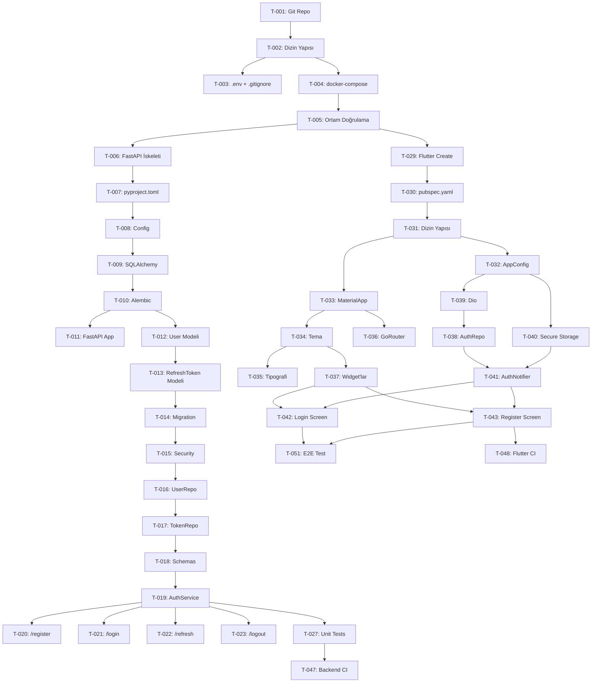

# StudyOS — Sprint-1 Planı

**Belge Durumu:** Aktif  
**Sürüm:** 1.0  
**Oluşturuldu:** 2026-07-06 — Meeting-008  
**Dil:** Türkçe  
**Sprint Süresi:** 2 hafta (14 gün)  
**Sprint Tarihi:** [ONAY GEREKTİRİR — Başlangıç tarihi belirlenecek]  
**Ekip:** 2 geliştirici

---

## Sprint Hedefi

> **"Sprint-1 sonunda, bir kullanıcı uygulamaya kayıt olabilmeli, giriş yapabilmeli ve güvenli oturum yönetimi çalışır durumda olmalıdır."**

Sprint-1, geliştirme altyapısını kurar ve kimlik doğrulama akışını uçtan uca tamamlar. İş mantığı özelliklerine (çalışma planı, pomodoro vb.) Sprint-2'de başlanır.

**Kapsam:**
- Proje kurulumu (repo, CI, ortam)
- Backend kimlik doğrulama (kayıt, giriş, token, şifre sıfırlama)
- Flutter mobil kimlik doğrulama ekranları (giriş, kayıt)
- Tema ve navigasyon altyapısı
- Temel CI pipeline

**Kapsam Dışı:**
- Çalışma planı, konu takibi, pomodoro (Sprint-2)
- Kurumsal web platformu (Sprint-3+)
- AI entegrasyonu (Sprint-4+)
- Push notification (Sprint-2)

---

## Geliştirici Rolleri

| Rol | Sprint-1 Odağı |
|-----|---------------|
| **Geliştirici A** | Backend (FastAPI, PostgreSQL, JWT, API) |
| **Geliştirici B** | Frontend (Flutter, tema, navigasyon, ekranlar) |

> İki geliştirici birbirinden bağımsız çalışabilmek için önce API sözleşmesi (`/auth` endpoint'leri) netleştirilir, ardından paralel geliştirme başlar.

---

## Görev Listesi

### Blok 0 — Altyapı (Gün 1–2)

Tüm görevler her iki geliştiricinin ortamını hazırlaması için Sprint başında tamamlanır.

| # | Görev | Sorumlu | Süre | Öncelik | Bağımlılık |
|---|-------|---------|------|---------|-----------|
| T-001 | Git deposu oluşturma; `main` ve `develop` dallarını ve dal koruma kurallarını konfigüre etme | A | 2 sa | 🔴 Kritik | — |
| T-002 | Depo dizin yapısını oluşturma (`mobile/`, `web/`, `backend/`, `docs/`, `scripts/`, `.github/`) | A | 1 sa | 🔴 Kritik | T-001 |
| T-003 | `.env.example`, `.gitignore`, `.editorconfig` dosyalarını oluşturma | A | 1 sa | 🔴 Kritik | T-002 |
| T-004 | `docker-compose.yml` — PostgreSQL 16 + MinIO servisleri | A | 2 sa | 🔴 Kritik | T-002 |
| T-005 | Her iki geliştirici ortam kurulum doğrulaması (flutter doctor, python version, docker up) | Her ikisi | 1 sa | 🔴 Kritik | T-001..T-004 |

---

### Blok 1 — Backend Proje Kurulumu (Gün 2–3)

| # | Görev | Sorumlu | Süre | Öncelik | Bağımlılık |
|---|-------|---------|------|---------|-----------|
| T-006 | FastAPI proje iskeleti oluşturma (`backend/` dizin yapısı: `app/`, `core/`, `api/`, `models/`, vb.) | A | 2 sa | 🔴 Kritik | T-004 |
| T-007 | `pyproject.toml` bağımlılık tanımı ve `uv sync` | A | 1 sa | 🔴 Kritik | T-006 |
| T-008 | `pydantic-settings` ile ortam değişkeni konfigürasyonu (`app/core/config.py`) | A | 2 sa | 🔴 Kritik | T-007 |
| T-009 | SQLAlchemy async engine ve session factory kurulumu (`app/database/base.py`, `session.py`) | A | 2 sa | 🔴 Kritik | T-008 |
| T-010 | Alembic kurulumu ve ilk migration (boş başlangıç) | A | 1 sa | 🔴 Kritik | T-009 |
| T-011 | FastAPI app oluşturma, CORS middleware, health-check endpoint (`GET /api/v1/health`) | A | 2 sa | 🔴 Kritik | T-010 |

---

### Blok 2 — Backend Kimlik Doğrulama (Gün 3–7)

| # | Görev | Sorumlu | Süre | Öncelik | Bağımlılık |
|---|-------|---------|------|---------|-----------|
| T-012 | `User` SQLAlchemy modeli (tüm alanlar: status Enum, deletion_requested_at dahil) | A | 2 sa | 🔴 Kritik | T-010 |
| T-013 | `RefreshToken` SQLAlchemy modeli | A | 1 sa | 🔴 Kritik | T-012 |
| T-014 | Alembic migration: User + RefreshToken tabloları | A | 1 sa | 🔴 Kritik | T-013 |
| T-015 | `app/core/security.py` — bcrypt şifre hash ve doğrulama, JWT üretme/doğrulama | A | 3 sa | 🔴 Kritik | T-012 |
| T-016 | `UserRepository` — e-posta ile kullanıcı sorgulama, kayıt | A | 2 sa | 🔴 Kritik | T-015 |
| T-017 | `RefreshTokenRepository` — token kaydetme, sorgulama, iptal etme | A | 2 sa | 🔴 Kritik | T-016 |
| T-018 | Pydantic şemalar: `RegisterRequest`, `LoginRequest`, `TokenResponse`, `UserRead` | A | 2 sa | 🔴 Kritik | T-012 |
| T-019 | `AuthService` — kayıt, giriş, token yenileme, çıkış mantığı | A | 4 sa | 🔴 Kritik | T-017, T-018 |
| T-020 | `POST /api/v1/auth/register` endpoint | A | 1 sa | 🔴 Kritik | T-019 |
| T-021 | `POST /api/v1/auth/login` endpoint | A | 1 sa | 🔴 Kritik | T-019 |
| T-022 | `POST /api/v1/auth/refresh` endpoint (token rotation) | A | 1 sa | 🔴 Kritik | T-019 |
| T-023 | `POST /api/v1/auth/logout` endpoint | A | 1 sa | 🔴 Kritik | T-019 |
| T-024 | E-posta doğrulama token sistemi (`POST /api/v1/auth/verify-email`) | A | 3 sa | 🟡 Yüksek | T-019 |
| T-025 | Şifre sıfırlama akışı (`forgot-password`, `reset-password`) | A | 3 sa | 🟡 Yüksek | T-024 |
| T-026 | `GET /api/v1/users/me` endpoint + JWT `Depends()` guard | A | 2 sa | 🔴 Kritik | T-021 |
| T-027 | `AuthService` birim testleri (kayıt, giriş, geçersiz şifre, token rotation) | A | 4 sa | 🔴 Kritik | T-019 |
| T-028 | `/auth` endpoint entegrasyon testleri (httpx TestClient) | A | 3 sa | 🟡 Yüksek | T-020..T-026 |

---

### Blok 3 — Flutter Proje Kurulumu (Gün 2–3)

| # | Görev | Sorumlu | Süre | Öncelik | Bağımlılık |
|---|-------|---------|------|---------|-----------|
| T-029 | `mobile/` Flutter proje oluşturma (`flutter create --org com.studyos mobile`) | B | 1 sa | 🔴 Kritik | T-002 |
| T-030 | `pubspec.yaml` bağımlılık tanımı ve `flutter pub get` | B | 1 sa | 🔴 Kritik | T-029 |
| T-031 | `mobile/lib/` dizin yapısını oluşturma (`core/`, `features/`, `shared/`, `services/`) | B | 2 sa | 🔴 Kritik | T-029 |
| T-032 | `.dart-define` konfigürasyonu; `AppConfig` sabit sınıfı (`core/constants/app_config.dart`) | B | 1 sa | 🔴 Kritik | T-031 |
| T-033 | `ProviderScope` ile `MaterialApp` kurulumu (`app.dart`, `main.dart`) | B | 1 sa | 🔴 Kritik | T-031 |

---

### Blok 4 — Flutter Tema ve Navigasyon (Gün 3–5)

| # | Görev | Sorumlu | Süre | Öncelik | Bağımlılık |
|---|-------|---------|------|---------|-----------|
| T-034 | Renk paleti ve ThemeData tanımı (`core/theme/app_theme.dart`, `app_colors.dart`) | B | 3 sa | 🔴 Kritik | T-033 |
| T-035 | Tipografi tanımı — Google Fonts entegrasyonu (`core/theme/app_typography.dart`) | B | 1 sa | 🟡 Yüksek | T-034 |
| T-036 | GoRouter kurulumu; auth guard, başlangıç rotası, redirect mantığı (`core/router/app_router.dart`) | B | 3 sa | 🔴 Kritik | T-033 |
| T-037 | Paylaşımlı temel widget'lar: `AppButton`, `AppTextField`, `AppLoadingOverlay` (`shared/widgets/`) | B | 4 sa | 🟡 Yüksek | T-034 |

---

### Blok 5 — Flutter Kimlik Doğrulama Ekranları (Gün 5–10)

| # | Görev | Sorumlu | Süre | Öncelik | Bağımlılık |
|---|-------|---------|------|---------|-----------|
| T-038 | `AuthRepository` interface ve implementasyonu (`features/auth/domain/repositories/`, `data/repositories/`) | B | 3 sa | 🔴 Kritik | T-032 |
| T-039 | Dio konfigürasyonu: base URL, JWT interceptor, refresh token otomasyonu (`core/network/`) | B | 4 sa | 🔴 Kritik | T-032 |
| T-040 | `flutter_secure_storage` ile token depolama servisi (`services/local_storage_service.dart`) | B | 2 sa | 🔴 Kritik | T-030 |
| T-041 | `AuthNotifier` Riverpod provider (giriş, kayıt, çıkış durumu yönetimi) | B | 3 sa | 🔴 Kritik | T-038, T-040 |
| T-042 | Giriş Ekranı (`features/auth/presentation/screens/login_screen.dart`) | B | 4 sa | 🔴 Kritik | T-037, T-041 |
| T-043 | Kayıt Ekranı (`features/auth/presentation/screens/register_screen.dart`) | B | 3 sa | 🔴 Kritik | T-037, T-041 |
| T-044 | Şifre Sıfırlama Ekranı (`features/auth/presentation/screens/forgot_password_screen.dart`) | B | 2 sa | 🟡 Yüksek | T-037, T-041 |
| T-045 | Geçici Dashboard Ekranı (giriş sonrası placeholder) | B | 1 sa | 🟡 Yüksek | T-036 |
| T-046 | Auth akışı widget testleri | B | 3 sa | 🟡 Yüksek | T-042, T-043 |

---

### Blok 6 — CI Pipeline (Gün 8–10)

| # | Görev | Sorumlu | Süre | Öncelik | Bağımlılık |
|---|-------|---------|------|---------|-----------|
| T-047 | GitHub Actions backend CI pipeline (`backend-ci.yml`): ruff + mypy + pytest | A | 3 sa | 🟡 Yüksek | T-028 |
| T-048 | GitHub Actions Flutter CI pipeline (`mobile-ci.yml`): analyze + test | B | 2 sa | 🟡 Yüksek | T-046 |
| T-049 | PR şablonu oluşturma (`.github/PULL_REQUEST_TEMPLATE.md`) | A | 30 dk | 🟢 Normal | T-001 |
| T-050 | Dal koruma kuralları — `main` ve `develop` PR zorunluluğu ve CI geçme kuralı | A | 30 dk | 🟡 Yüksek | T-047, T-048 |

---

### Blok 7 — Sprint-1 Tamamlama (Gün 11–14)

| # | Görev | Sorumlu | Süre | Öncelik | Bağımlılık |
|---|-------|---------|------|---------|-----------|
| T-051 | Uçtan uca test: Kayıt → Giriş → Dashboard akışının gerçek backend ile manuel testi | Her ikisi | 3 sa | 🔴 Kritik | T-043, T-026 |
| T-052 | Hata yönetimi gözden geçirme: network hataları, 401/403 senaryoları | Her ikisi | 2 sa | 🟡 Yüksek | T-051 |
| T-053 | Sprint-1 review: tamamlanan görevlerin gözden geçirilmesi | Her ikisi | 1 sa | 🔴 Kritik | T-051 |
| T-054 | Sprint-2 planlama hazırlığı: açık kalan görevlerin `backlog`'a taşınması | A | 1 sa | 🟡 Yüksek | T-053 |

---

## Tahmini Süre Özeti

| Blok | Geliştirici A | Geliştirici B |
|------|-------------|-------------|
| Blok 0 — Altyapı | 3 sa | 3 sa |
| Blok 1 — Backend Kurulum | 10 sa | — |
| Blok 2 — Backend Auth | 33 sa | — |
| Blok 3 — Flutter Kurulum | — | 6 sa |
| Blok 4 — Tema + Navigasyon | — | 11 sa |
| Blok 5 — Auth Ekranları | — | 25 sa |
| Blok 6 — CI Pipeline | 4 sa | 2.5 sa |
| Blok 7 — Tamamlama | 4 sa | 4 sa |
| **Toplam** | **~54 sa** | **~51.5 sa** |

> 2 hafta × 5 iş günü × 5–6 saat/gün = ~50–60 saat/geliştirici. Sprint kapasitesiyle uyumlu.

---

## Sprint-1 Bağımlılık Grafiği

---

## Riskler

| Risk | Olasılık | Etki | Azaltma |
|------|---------|------|---------|
| JWT interceptor + token rotation Flutter'da beklenenden uzun sürer | Orta | Yüksek | T-039 erkene alınır; backend mock ile başlanır |
| MinIO yerel kurulumu ortam sorunları | Düşük | Orta | `docker compose up` ile basit; alternatif olarak doğrudan AWS S3 dev kullanılır |
| E-posta doğrulama SMTP konfigürasyonu | Orta | Düşük | Başlangıçta loglara yazdırılır; gerçek SMTP Sprint-2'de devreye alınır |
| GitHub Actions runner süresi | Düşük | Düşük | 2.000 dk/ay ücretsiz; Sprint-1 için yeterli |

---

## Sprint-1 Kabul Kriterleri

Sprint-1 **başarılı** sayılmak için aşağıdaki tüm kriterler karşılanmalıdır:

- [ ] Kullanıcı e-posta ve şifre ile kayıt olabilir.
- [ ] Kullanıcı kayıtlı e-posta/şifre ile giriş yapabilir.
- [ ] Giriş sonrası access token + refresh token döner.
- [ ] Korumalı endpoint (`GET /users/me`) JWT olmadan 401 döner.
- [ ] Refresh token ile yeni access token alınabilir.
- [ ] Çıkış işlemi refresh token'ı geçersiz kılar.
- [ ] Flutter uygulaması giriş ekranını gösterir ve backend'e bağlanır.
- [ ] Kayıt ekranından giriş yapıldıktan sonra dashboard'a yönlendirilir.
- [ ] CI pipeline yeşil: backend ve Flutter testleri geçiyor.
- [ ] `develop` dalında hiç linting hatası yok.

---

## Sürüm Geçmişi

| Sürüm | Tarih | Değişiklik |
|-------|-------|-----------|
| 1.0 | 2026-07-06 | İlk sürüm — Meeting-008 |
